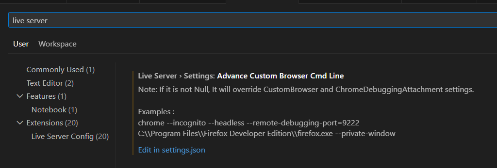
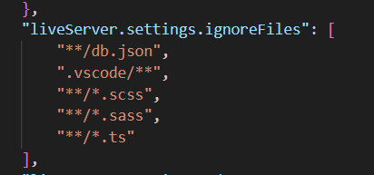

# 🗺️ Multiplayer Battle Royale Map Game

A lightweight **2-player, browser-based battle royale game** built with **Leaflet** and **Node.js**. Players join via unique URLs, move on a shared map, collect objectives, and survive inside a shrinking safe zone.

---

## Features

- Two-player multiplayer via shareable invite links  
- Interactive map using Leaflet + OpenStreetMap  
- Shrinking safe zone (battle royale mechanic)  
- HP loss outside the circle  
- Real-world objectives loaded as GeoJSON  
- Server-synced game state with polling  
- Host / Player role separation  

---

## Tech Stack

- **Frontend:** Vanilla JavaScript, Leaflet  
- **Backend:** Node.js, Express  
- **Data Sync:** REST API + polling  
- **Map Data:** OpenStreetMap  

---

## How to Run

Before running the game with Live Server in VScode. Please follow these steps:

1. 

Go to the Setting in VSCode, look for Live Server, then go "Edit in settings.json"

2. 

Add the path to db.json like above to the files that Live Server should ignore.


These steps are needed to make sure that LiveServer doesn't reset everytime new data is written in DB.json file.


```bash
npm install
node server.js
```

- Then open the game with Live Server Extension in VSCode (via the index.html file)

## Notes

- Player 1 (host) controls game setup
- Player 2 joins in play-only mode
- Game state syncs every 500ms
- Have fun surviving the zone!
